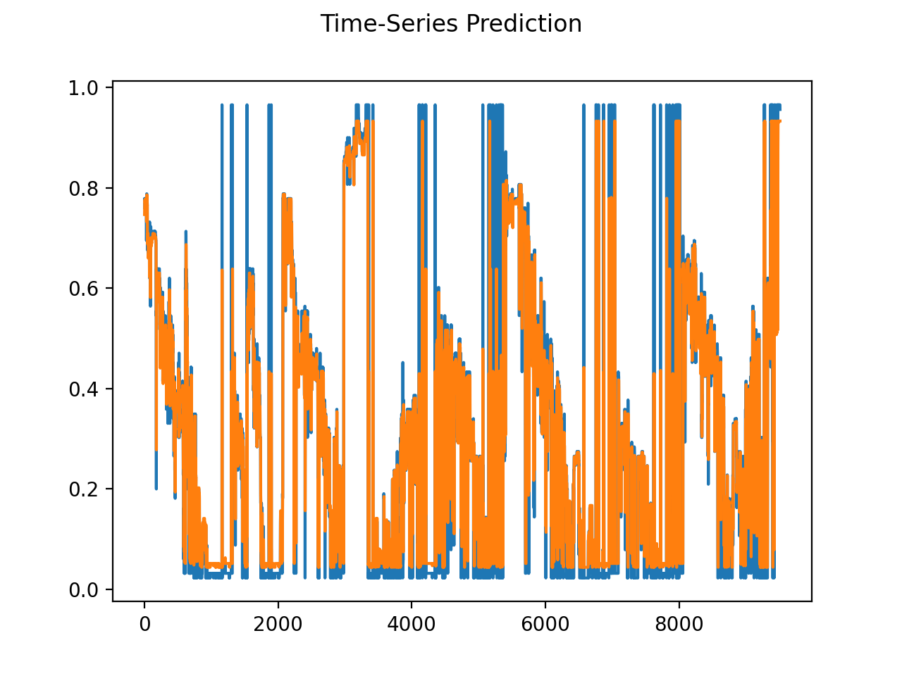

# Predicting the fill levels of smart bins

The repository can be used to train a forecast model for prediciting the fill levels for smart bins. Currently, it is possible to train the following model architectures:
- LSTM

## Results

The LSTM model architecture achieves the following results on the test set:

- R2 = 0.77
- MSE = 0.018
- RMSE = 0.136

Plot of the forecast:

Blue: Ground Truth
Orange: Predictions



## Directory overview
```
.
├── README.md
├── notebooks # Notebooks for data exploration
├── predictor
│   ├── config.py
│   ├── create_dataset.py
│   ├── create_features.py
│   ├── create_folders.py
│   ├── lstm_evaluate_model.py
│   ├── lstm_model.py
│   ├── lstm_trainer.py
│   └── utils
│       └── helpers.py # Helper functions
└── requirements.txt # Needed for creating Pyton env
```

## Virtual environment: 
Installing the necessary Python packages with the requirements.txt (Python 3.7)
```
$ python -m pip install -r requirements.txt
```
## Running the LSTM training

### 1. Step: Create folder structure for assets.

```
python create_folders.py
```
Then upload your file called Smart-Bins-Messwerte(1).xlsx to the folder raw_dataset
### 2. Step: Create the dataset.

```
python create_dataset.py
```
### 3. Step: Create features for model training.

```
python create_features.py
```
### 4. Step: Perform LSTM model training.

```
python lstm_trainer.py
```
### 5. Step: Evaluate the results.

```
python lstm_evaluate_model
```
## Contributing

1. Create your Feature Branch (`git checkout -b feature/<...>`)
2. Commit your Changes (`git commit -m 'Add some AmazingFeature'`)
3. Ensure your Changes are ready to be pushed (`make push-check`). If you see the following message you are ready:
4. Push to the Branch (`git push`)
5. Open a Pull Request